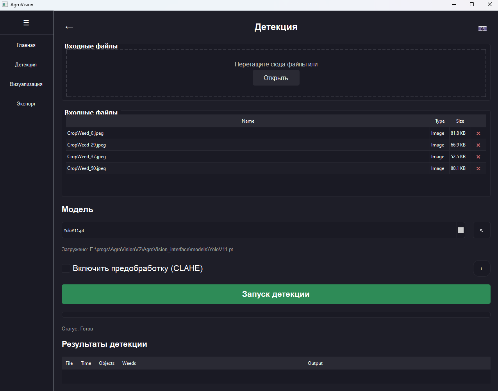
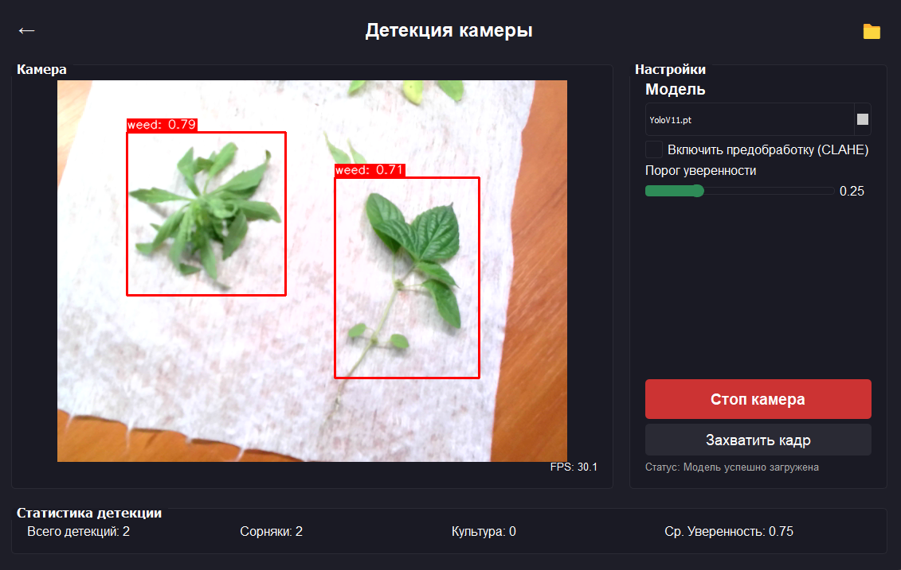
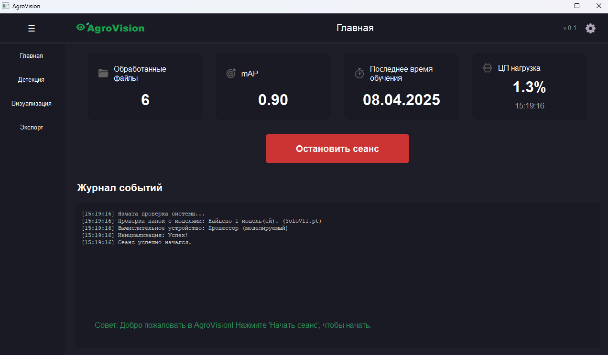
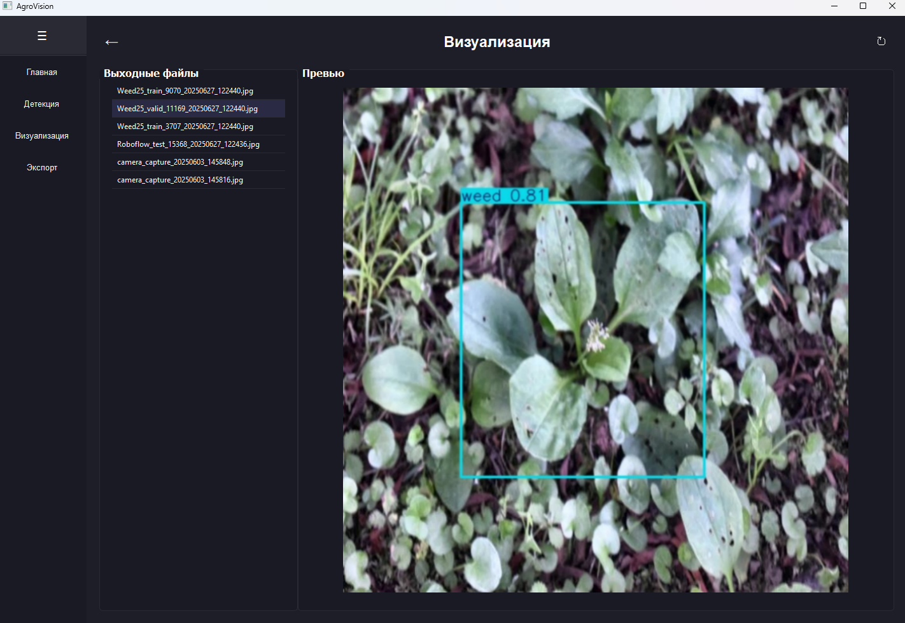
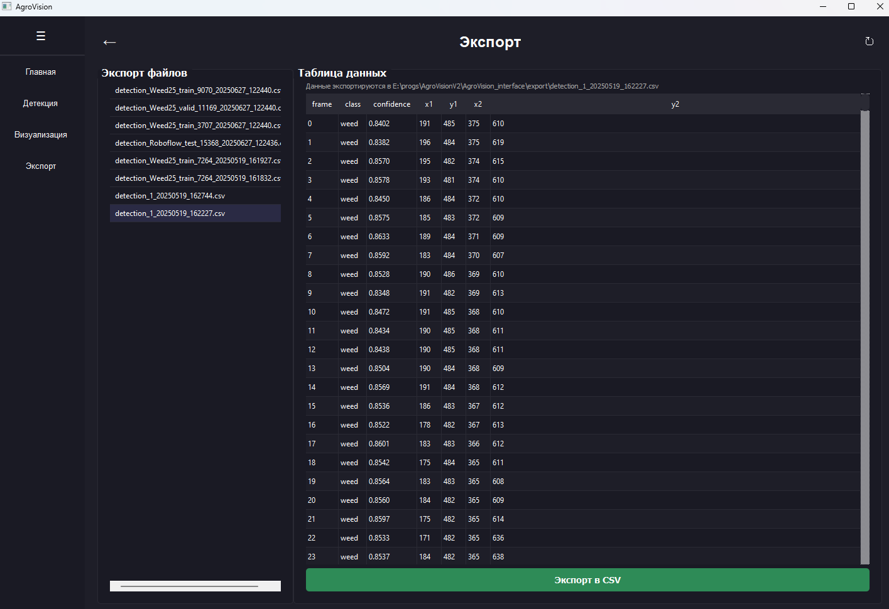
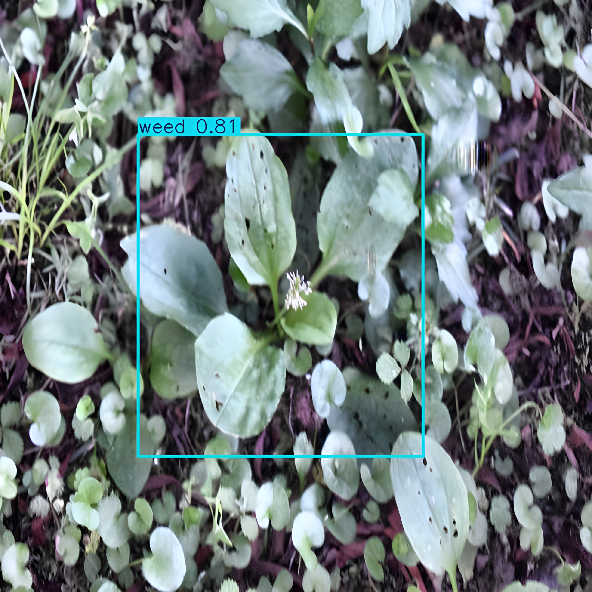
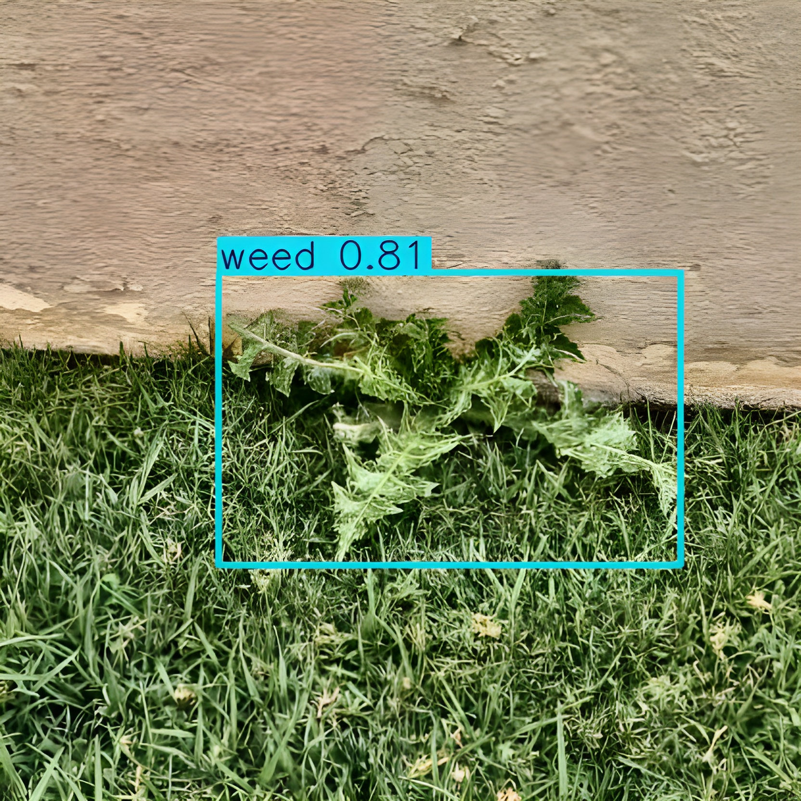

📌 Аннотация (RU)

AgroVision — это модульная система компьютерного зрения для автоматической детекции сорной растительности на сельскохозяйственных полях. В основе лежит сверточная нейросеть YOLOv11, адаптированная для работы в реальном времени (≥20 FPS) на периферийных устройствах (NVIDIA Jetson). Система включает модули предобработки (CLAHE, цветовые преобразования), визуализации, генерации CSV-отчётов и поддерживает экспорт bounding box координат и классов в формате YOLO. Разработана для интеграции с точечными опрыскивателями и позволяет сократить затраты на гербициды до 80 %.

Проект прошёл акселерацию в рамках программы «Интеллектуальные технологии в АПК» и стал победителем финальной защиты. В дальнейшем был доработан и существенно расширен в рамках трека «Стартап как диплом», где успешно защищён на «отлично».

📌 Abstract (EN)

AgroVision is a modular computer vision system for real-time weed detection in agricultural fields. It utilizes a custom-trained YOLOv11 convolutional neural network optimized for edge devices (NVIDIA Jetson) with real-time performance (≥20 FPS). The system includes preprocessing modules (CLAHE, color space transforms), visualization tools, and CSV report generation. It outputs bounding box coordinates and class labels in YOLO format and is designed for integration with precision sprayers, reducing herbicide usage by up to 80%.

The project was initially developed and awarded first place during the "Intelligent Technologies in Agriculture" acceleration program. It was later improved and expanded as part of the "Startup as a Thesis" track and successfully defended with the highest grade.

Скриншоты программы/Screenshots of the program

Примеры детекций/Examples of detections

